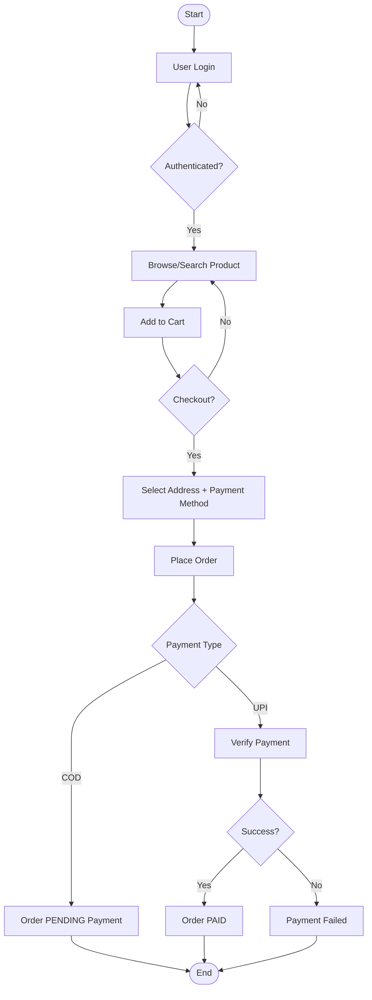

# Activity Diagram

```mermaid
flowchart TD
    A([Start]) --> B[User Login]
    B --> C{Authenticated?}
    C -- No --> B
    C -- Yes --> D[Browse/Search Product]
    D --> E[Add to Cart]
    E --> F{Checkout?}
    F -- No --> D
    F -- Yes --> G[Select Address + Payment Method]
    G --> H[Place Order]
    H --> I{Payment Type}
    I -- COD --> J[Order PENDING Payment]
    I -- UPI --> K[Verify Payment]
    K --> L{Success?}
    L -- No --> M[Payment Failed]
    L -- Yes --> N[Order PAID]
    J --> O([End])
    N --> O
    M --> O
```
