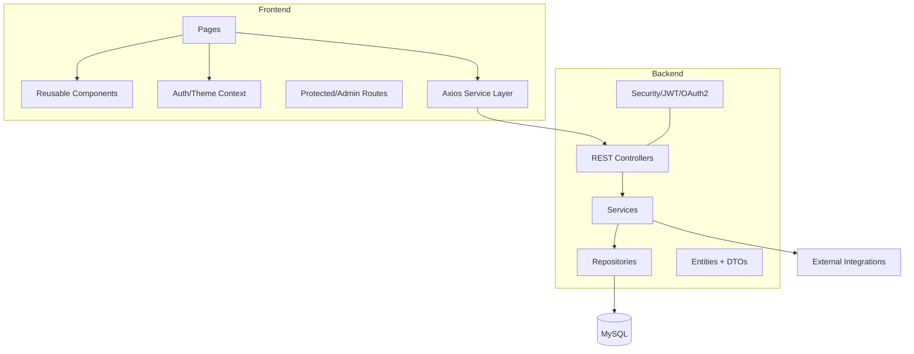

# Components Diagram

```mermaid
flowchart TB
    subgraph Frontend
      PAGES[Pages]
      COMPONENTS[Reusable Components]
      CONTEXT[Auth/Theme Context]
      ROUTES[Protected/Admin Routes]
      SERVICES[Axios Service Layer]
    end

    subgraph Backend
      APICTRL[REST Controllers]
      BIZ[Services]
      DATA[Repositories]
      DOMAIN[Entities + DTOs]
      SEC[Security/JWT/OAuth2]
    end

    DB[(MySQL)]
    EXT[External Integrations]

    PAGES --> COMPONENTS
    PAGES --> CONTEXT
    PAGES --> SERVICES
    SERVICES --> APICTRL
    APICTRL --> BIZ
    BIZ --> DATA
    DATA --> DB
    BIZ --> EXT
    SEC --- APICTRL
```
