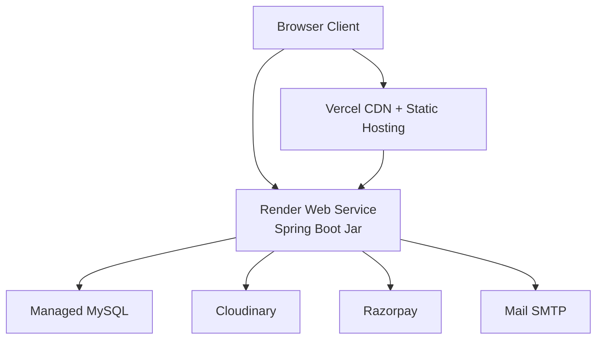

# Deployment Diagram

```mermaid
flowchart TB
    USER[Browser Client]
    CDN[Vercel CDN + Static Hosting]
    APP[Render Web Service<br/>Spring Boot Jar]
    MYSQL[Managed MySQL]
    CLOUD[Cloudinary]
    PAYMENT[Razorpay]
    SMTP[Mail SMTP]

    USER --> CDN
    USER --> APP
    CDN --> APP
    APP --> MYSQL
    APP --> CLOUD
    APP --> PAYMENT
    APP --> SMTP
```
