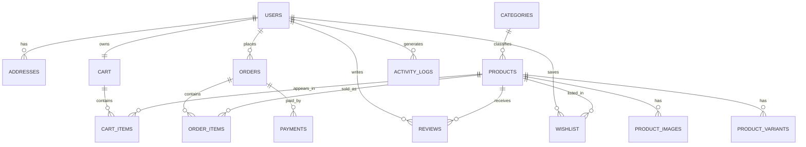

# Entity-Relationship (E-R) Diagram

```mermaid
erDiagram
    USERS ||--o{ ADDRESSES : has
    USERS ||--|| CART : owns
    CART ||--o{ CART_ITEMS : contains
    PRODUCTS ||--o{ CART_ITEMS : appears_in

    USERS ||--o{ ORDERS : places
    ORDERS ||--o{ ORDER_ITEMS : contains
    PRODUCTS ||--o{ ORDER_ITEMS : sold_as

    CATEGORIES ||--o{ PRODUCTS : classifies
    PRODUCTS ||--o{ PRODUCT_IMAGES : has
    PRODUCTS ||--o{ PRODUCT_VARIANTS : has

    USERS ||--o{ REVIEWS : writes
    PRODUCTS ||--o{ REVIEWS : receives

    USERS ||--o{ WISHLIST : saves
    PRODUCTS ||--o{ WISHLIST : listed_in

    ORDERS ||--o{ PAYMENTS : paid_by
    USERS ||--o{ ACTIVITY_LOGS : generates
```
