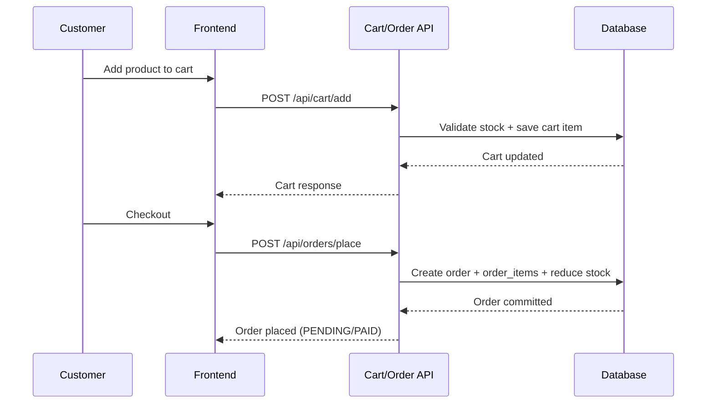

# Sequence Diagram - Cart to Order Flow

```mermaid
sequenceDiagram
    participant U as Customer
    participant FE as Frontend
    participant BE as Cart/Order API
    participant DB as Database

    U->>FE: Add product to cart
    FE->>BE: POST /api/cart/add
    BE->>DB: Validate stock + save cart item
    DB-->>BE: Cart updated
    BE-->>FE: Cart response

    U->>FE: Checkout
    FE->>BE: POST /api/orders/place
    BE->>DB: Create order + order_items + reduce stock
    DB-->>BE: Order committed
    BE-->>FE: Order placed (PENDING/PAID)
```
