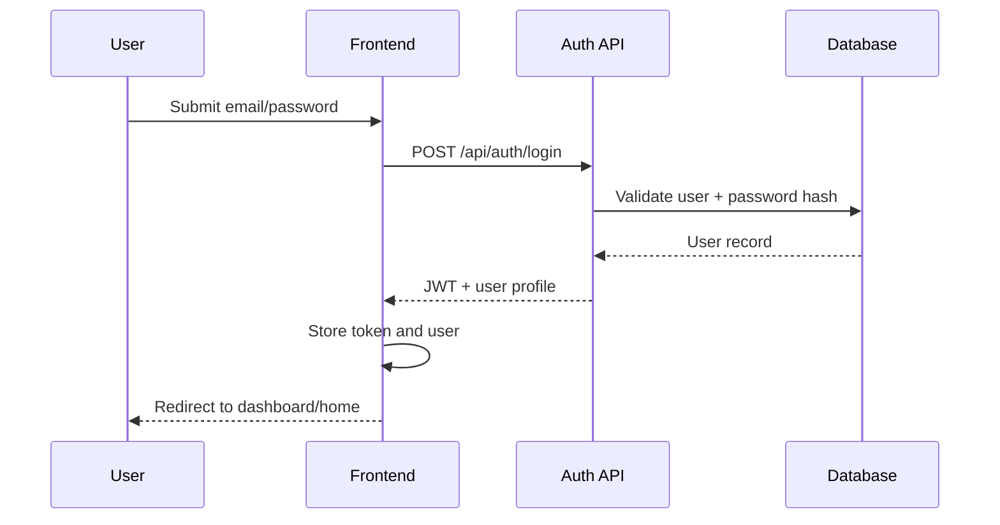

# Sequence Diagram - Login Flow

```mermaid
sequenceDiagram
    participant U as User
    participant FE as Frontend
    participant BE as Auth API
    participant DB as Database

    U->>FE: Submit email/password
    FE->>BE: POST /api/auth/login
    BE->>DB: Validate user + password hash
    DB-->>BE: User record
    BE-->>FE: JWT + user profile
    FE->>FE: Store token and user
    FE-->>U: Redirect to dashboard/home
```
