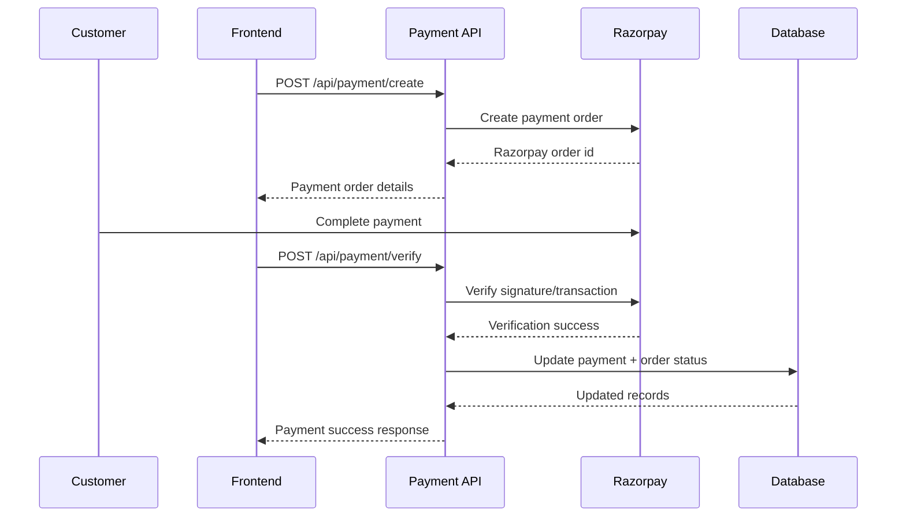

# Sequence Diagram - UPI Payment Verification Flow

```mermaid
sequenceDiagram
    participant U as Customer
    participant FE as Frontend
    participant BE as Payment API
    participant RP as Razorpay
    participant DB as Database

    FE->>BE: POST /api/payment/create
    BE->>RP: Create payment order
    RP-->>BE: Razorpay order id
    BE-->>FE: Payment order details

    U->>RP: Complete payment
    FE->>BE: POST /api/payment/verify
    BE->>RP: Verify signature/transaction
    RP-->>BE: Verification success
    BE->>DB: Update payment + order status
    DB-->>BE: Updated records
    BE-->>FE: Payment success response
```
