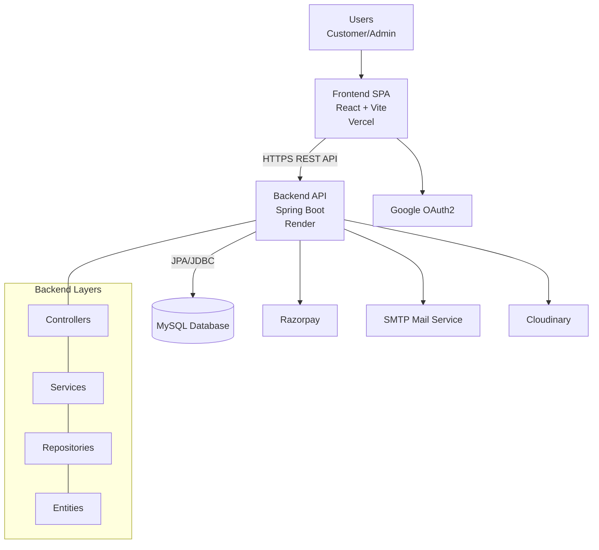

# System Architecture Diagram

```mermaid
flowchart TB
    U[Users<br/>Customer/Admin] --> FE[Frontend SPA<br/>React + Vite<br/>Vercel]
    FE -->|HTTPS REST API| BE[Backend API<br/>Spring Boot<br/>Render]
    BE -->|JPA/JDBC| DB[(MySQL Database)]

    BE --> PAY[Razorpay]
    BE --> MAIL[SMTP Mail Service]
    BE --> IMG[Cloudinary]
    FE --> OAUTH[Google OAuth2]

    subgraph Backend Layers
      C[Controllers]
      S[Services]
      R[Repositories]
      E[Entities]
    end

    BE --- C
    C --- S
    S --- R
    R --- E
```
