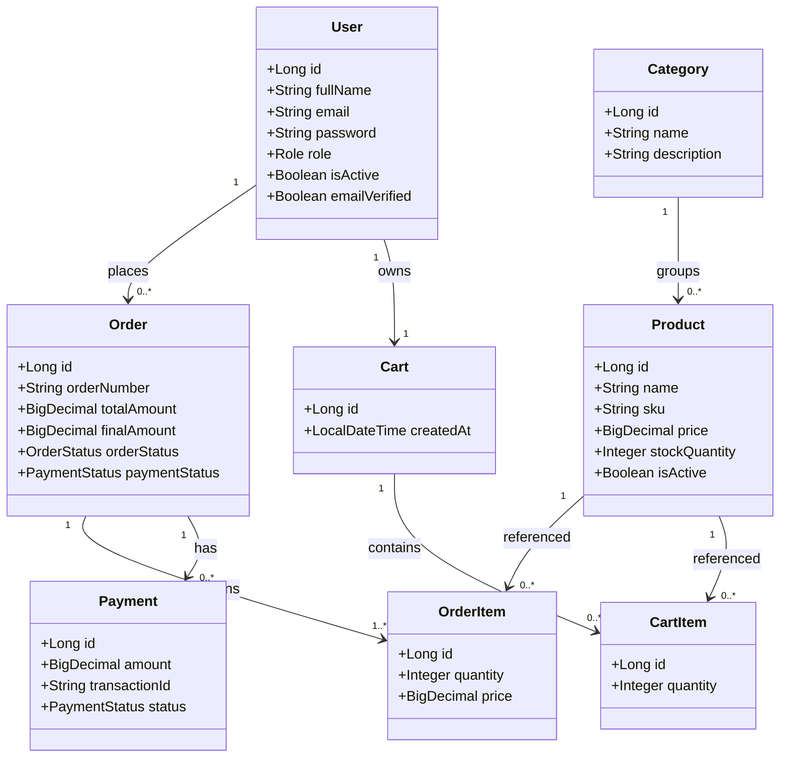

# UML - Class Diagram

```mermaid
classDiagram
    class User {
      +Long id
      +String fullName
      +String email
      +String password
      +Role role
      +Boolean isActive
      +Boolean emailVerified
    }

    class Product {
      +Long id
      +String name
      +String sku
      +BigDecimal price
      +Integer stockQuantity
      +Boolean isActive
    }

    class Category {
      +Long id
      +String name
      +String description
    }

    class Order {
      +Long id
      +String orderNumber
      +BigDecimal totalAmount
      +BigDecimal finalAmount
      +OrderStatus orderStatus
      +PaymentStatus paymentStatus
    }

    class OrderItem {
      +Long id
      +Integer quantity
      +BigDecimal price
    }

    class Cart {
      +Long id
      +LocalDateTime createdAt
    }

    class CartItem {
      +Long id
      +Integer quantity
    }

    class Payment {
      +Long id
      +BigDecimal amount
      +String transactionId
      +PaymentStatus status
    }

    User "1" --> "0..*" Order : places
    User "1" --> "1" Cart : owns
    Cart "1" --> "0..*" CartItem : contains
    Order "1" --> "1..*" OrderItem : contains
    Product "1" --> "0..*" OrderItem : referenced
    Product "1" --> "0..*" CartItem : referenced
    Category "1" --> "0..*" Product : groups
    Order "1" --> "0..*" Payment : has
```
