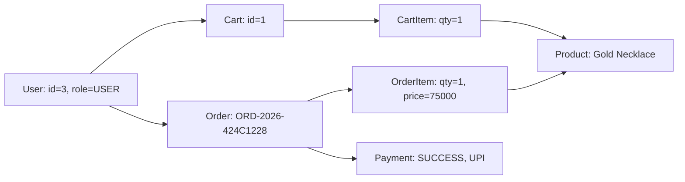

# UML - Object Diagram

```mermaid
flowchart LR
    U1[User: id=3, role=USER]
    C1[Cart: id=1]
    CI1[CartItem: qty=1]
    P13[Product: Gold Necklace]
    O5[Order: ORD-2026-424C1228]
    OI7[OrderItem: qty=1, price=75000]
    PM5[Payment: SUCCESS, UPI]

    U1 --> C1
    C1 --> CI1
    CI1 --> P13
    U1 --> O5
    O5 --> OI7
    OI7 --> P13
    O5 --> PM5
```
