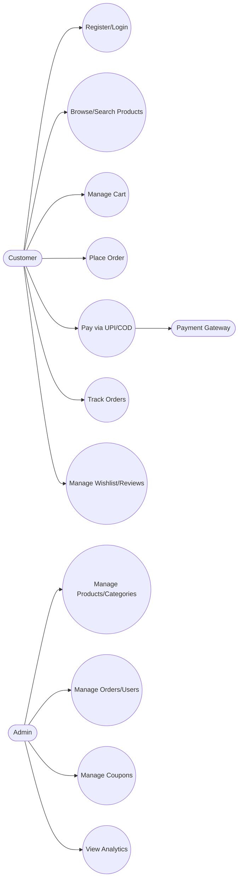

# Use-Case Diagram

```mermaid
flowchart LR
    CUST([Customer])
    ADMIN([Admin])
    PAY([Payment Gateway])

    UC1((Register/Login))
    UC2((Browse/Search Products))
    UC3((Manage Cart))
    UC4((Place Order))
    UC5((Pay via UPI/COD))
    UC6((Track Orders))
    UC7((Manage Wishlist/Reviews))

    UA1((Manage Products/Categories))
    UA2((Manage Orders/Users))
    UA3((Manage Coupons))
    UA4((View Analytics))

    CUST --> UC1
    CUST --> UC2
    CUST --> UC3
    CUST --> UC4
    CUST --> UC5
    CUST --> UC6
    CUST --> UC7

    ADMIN --> UA1
    ADMIN --> UA2
    ADMIN --> UA3
    ADMIN --> UA4

    UC5 --> PAY
```
